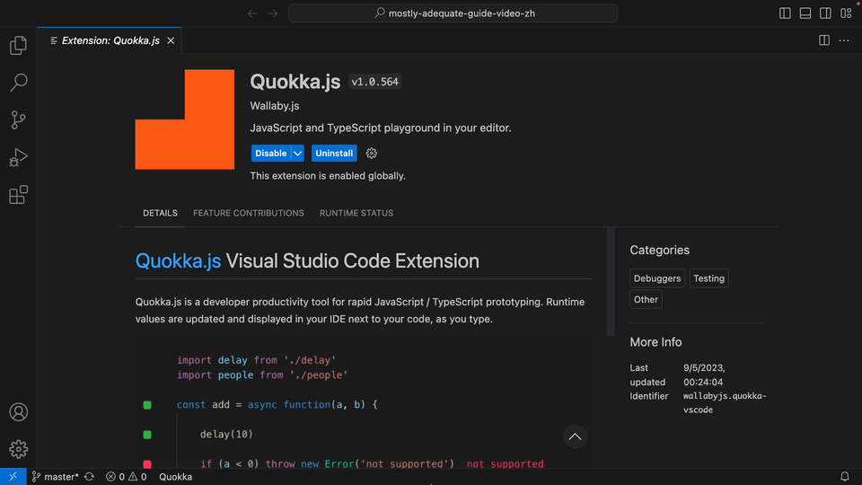
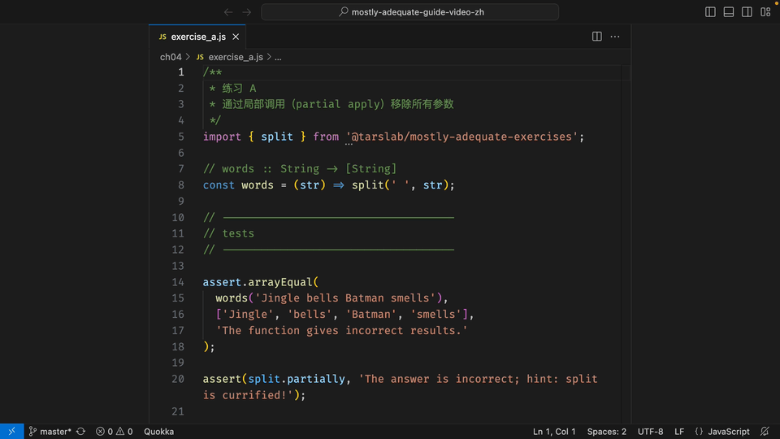
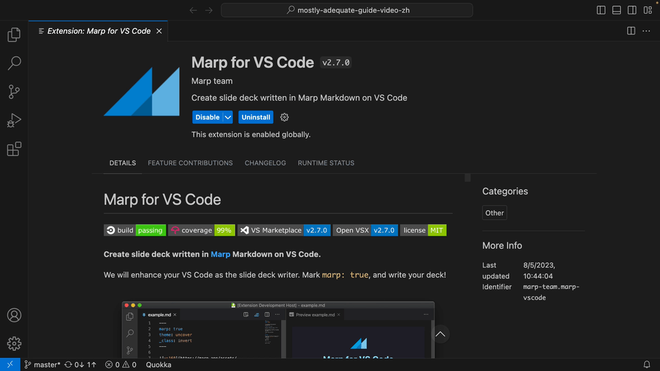

> Video tutorial series on *[mostly-adequate-guide](https://github.com/MostlyAdequate/mostly-adequate-guide)*。

[函数式编程指南](https://github.com/MostlyAdequate/mostly-adequate-guide)的中文讲解系列视频，视频里面提到的代码和课件都在该项目里。

视频系列中对白的主要参考[函数式编程指北](https://github.com/llh911001/mostly-adequate-guide-chinese)

[油管视频播放列表 ｜ 函数式编程指南Mostly Adequate Guide to Functional Programming](https://www.youtube.com/playlist?list=PLRbfM7ni8J_b3srXmaUJQSghvnVbs5M0U)

# 介绍

这是我这么多年学习编程技术收获最大的一本书。我把函数式编程思维应用到自己的工作项目中，代码质量有了质的飞跃，以前难以重构的代码重新获得生命，重新迭代起来，学习的回报巨大。但是在我学习那么多技术书中，它的学习过程最为艰辛。在学习过程中，对代码一知半解，不知道如何跑起来，不知道其中逻辑如何。由于函数式编程思维的方式和常见的命令式编程很不一样，这个困难更加突出。学习编程毕竟离不开敲代码，动手做练习，但是仓库里的练习题，检查是否正确，需要跨越多个文件去检查，很耗时麻烦。

所以，我制作这个系列的视频教程，期望能够让大家减少学习中的一些不必要的麻烦。

# 更高效的学习体验

- 代码逐步演示和解读，[quokka.js插件](https://marketplace.visualstudio.com/items?itemName=WallabyJs.quokka-vscode)

- 练习易上手，把测试合到一起，实时反馈

- 幻灯片划重点，方便复习，[marp插件](https://marketplace.visualstudio.com/items?itemName=marp-team.marp-vscode)

# 油管视频导航

- [第 1 章: 我们在做什么？](https://www.youtube.com/watch?v=SPglUwr-ClY)
- [第 2 章: 一等公民的函数](https://www.youtube.com/watch?v=pK6ACSMsZJU)
