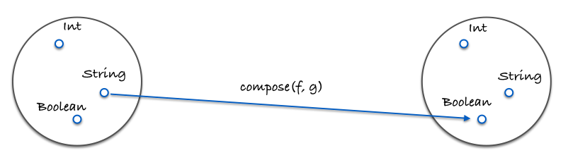

第 5 章

《函数式编程指南》

# 函数组合<br/>(compose)

---

## 函数饲养

### 组合的定义

```js
const compose = (...fns) => (...args) =>
  fns.reduceRight((res, fn) => [fn.call(null, ...res)], args)[0];
```

```js
// 简化版，只考虑输入是两个函数的情况
const compose2 = (f, g) => (x) => f(g(x));
```

---

### 组合像是在饲养函数

> 你就是饲养员，选择两个有特点又遭你喜欢的函数，让它们结合，产下一个崭新的函数

---

### 组合的执行顺序

* 组合中函数的执行顺序从右到左
* 组合的概念直接来自于数学课本

---

## 组合符合结合律

```js
compose(f, compose(g, h)) === compose(compose(f, g), h);
```

如果想把字符串变为大写，可以这么写:

```js
compose(toUpperCase, compose(head, reverse));
// 或者
compose(compose(toUpperCase, head), reverse);
```

---

* 结合律的好处，任何一个函数分组都可以被拆开来，<br/>然后再以它们自己的组合方式打包在一起
* 如何组合，最佳实践是让组合可复用

---

## Pointfree

> 函数无须提及将要操作的数据是什么样的。一等公民的函数、柯里化以及组合协作起来有助于实现pointfree模式。

---

### Pointfree 模式

* 能够减少不必要的命名
* 石蕊试纸试验，能检测函数是接受输入返回输出的小函数
* 是一把双刃剑，有时候也能混淆视听。<br/>可以使用它的时候就使用，不能使用的时候就用普通函数。

---

## Debug

```js
const trace = curry((tag, x) => {
  console.log(tag, x);
  return x;
});
```

* trace 函数允许我们在某个特定的点观察数据以便 debug

---

## 范畴学

* 对象（object）
* 态射（morphism）
* 变化式（transformation）

这些概念跟编程的联系非常紧密

---

一些相同的概念分别在不同理论下的形式：


---

### 一个范畴的构成

* 对象的集合
* 态射的集合
* 态射的组合
* 特殊态射identity

---

### 对象的集合

* 把数据类型视作所有可能的值的一个集合
* 举例，`Boolean` 是 `[true, false]` 的集合，`Number` 是所有实数的一个集合
* 可以用集合论（set theory）处理类型

---

### 态射的集合

态射是标准的纯函数

---

### 态射的组合

- 态射的组合就是本章讲的组合Compose
- 结合律是在范畴学中对任何组合都适用的一个特性

---




```js
const g = (x) => x.length;
const f = (x) => x === 4;
const isFourLetterWord = compose(f, g);
```

---

### 特殊态射identity

```js
const id = (x) => x;
```

这个特性对所有的一元函数(unary function) f 都成立：

```js
// identity
compose(id, f) === compose(f, id) === f;
// true
```

---

## 总结

* 组合像一系列管道那样把不同的函数联系在一起，数据在其中流动
* 组合是高于其他所有原则的设计原则
* 范畴学将用在指导应用架构、副作用建模和保证正确性
