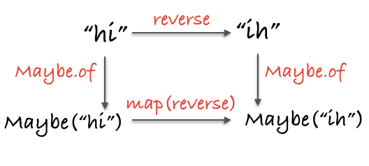

第 8 章

《函数式编程指南》

# Functor

---

## 万能的容器


* 容器 Container 只有一个属性
* $value 不能局限类型
* 数据一旦存放进去，就会一直在那里

---

## 第一个 Functor

> functor 是实现了 map 函数<br>并遵守一些特定规则的容器类型

---

### 为什么要用map？

- Q：让容器自己去运用函数的好处？
- A：抽象，对于函数运用的抽象

---

## 薛定谔的 Maybe


---

## 用例

- 发送失败信号 Maybe(null)
- map 遇到 null 会跳过计算

---

## 释放容器里的值

- 任何函数都要有一个结束
- Maybe里的不确定的值是魔鬼吗？
- 如果函数没有完成使命，可能是其他代码分支造成的

---


> 代码应该像薛定谔的猫一样，同时处于两种状态，并且保持这种状态直到最后一个函数为止。哪怕代码有很多逻辑的分支，也能保证一个直线的顺序流

---

### Maybe 总结

- Maybe 能够有效提高函数的安全性
- Maybe 的“真正”实现会把它分为两种类型:<br>一种是非空值，另一种是空值
- 遵守 map 的 parametricity 特性:<br>null 和 undefined 都能被 map 调用

---

## 纯的错误处理


### Either

- left &nbsp; 左边：错误情况下的值
- right 右边：正确情况下的值

---

### Lift

> 一个函数在调用的时候，如果被 map 包裹了，<br>那么它从一个非 functor 函数转换为一个 functor 函数，<br>我们把这个过程叫做 *Lift*

---

### 必要时再 Lift

- 普通函数更适合操作普通的数据类型而不是容器类型
- 必要的时候再通过 Lift 变为合适的容器去操作容器类型
- 复用性更好，能够随需求而变，兼容任意functor

---

### Either 不只是个包含错误的容器

- 表示逻辑或
- 范畴学 coproduct
- sum type (不相交并集)

---

## 多米诺骨牌的 IO


---

### 压栈


> 传给 map 的函数并没有运行，我们只是把它们压到一个“运行栈”的最末端而已，一个函数紧挨着另一个函数，就像小心摆放的多米诺骨牌

---

### 谁放出野兽

- 把责任推到调用者

---

## 异步 Task

- 回调地狱
- 使用 [Data.Task](https://github.com/folktale/data.task) 演示 

---

### Task 机制

- 类似IO，运行 Task 需要绿灯信号
- 对于异步场景，IO 被 Task 取代
- Task 的 map 操作，像 Todo 任务清单
- Task 的 异步调用，用 fork 方法

---

### 各种 Functor 都有用武之地

---

## 范畴学理论

同一律和结合律

```js
// identity
map(id) === id;

// composition
compose(map(f), map(g)) === map(compose(f, g));
```

---

### Functor 映射到新范畴


---

### Functor 映射


---

### 殊路同归



---

## 总结

- Maybe、Either、IO、Task
- Tree、List、Map、Pair
- Event Stream、Observable
- Functor 无处不在
